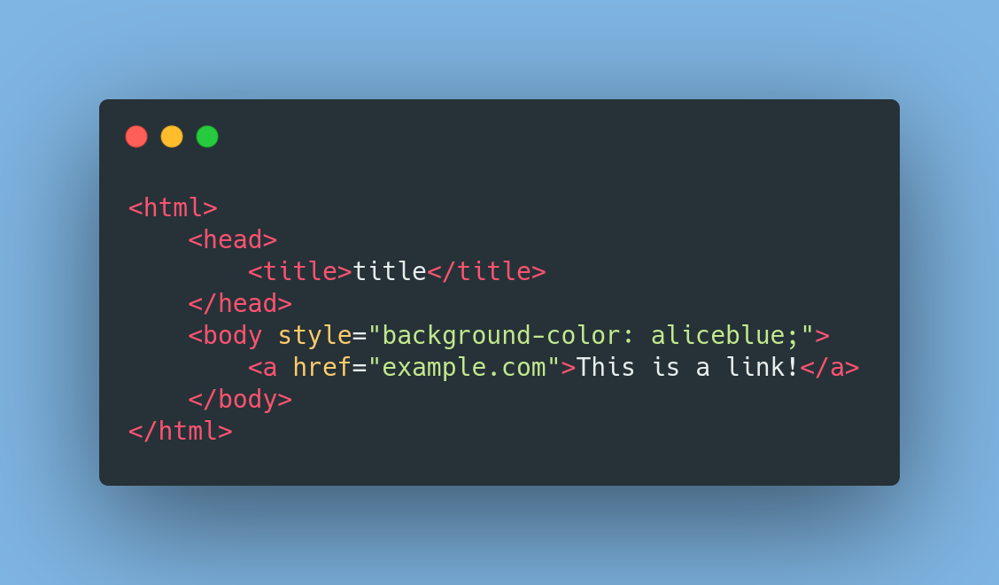
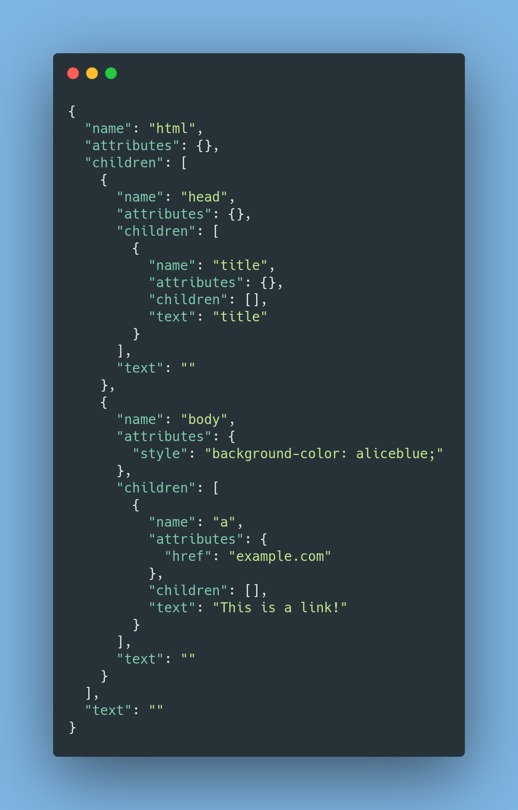

# WON
## Web Object Notation

## Introduction
Won is a multi purpose HTML/CSS to JSON (and vice-versa) converting tool. It is very useful for various applications in the field of web development, for example it helps a lot in web pages parsing and modification in some tedious languages like C, because all you have to do is use an easy JSON.
I made WON because recently, while making a web scraping project with C++, I noticed that in languages like this is very difficult to get a code (and human) friendly representation of an HTML page. (It is also my very first Open Source Project!)

## Table of Contents
1. [How is it made](#how-is-it-made)
2. [How does it works (CLI)](#how-does-it-works-(CLI))
3. [How does it works (JS)](#how-does-it-works-(JS))
4. [Comparison](#comparison)
5. [Features](#features)
6. [How to install](#how-to-install)
7. [Support](#support)

### How is it made?
It is currently made in Node.JS, using [htmlparser2](https://www.npmjs.com/package/htmlparser2) (go check their [repo](https://github.com/fb55/htmlparser2), this is an awesome Node Package) because this was the fastest implementation for HTML parsing on the NPM scenario.

(For the CSS Parsing I was struggling a bit, then I found an [answer](https://stackoverflow.com/questions/5240778/css-to-json-parser-or-converter/60451920#60451920) on Stack Overflow with a pretty decent already made algorithm for CSS parsing, so I said "Why not?". I just increased the readability of the code, but the algorithm is took from that answer.)
### How does it works (CLI)
It is currently a CLI utility and a JS library. Alongside the JS version, other languages binding will be developed.

Using `won -hj pathToFile.html` you will get a JSON output file, structured like a valid WON Object. Using `won -jh pathToFile.json` you will get a HTML file. Same for CSS, but use a `c` instead of the `h` (example: `won -cj pathToFile.css`). Add `-o outputName.o` to determine a name for the output file.

### How does it works (CLI)
Using `won -hj pathToFile.html` you will get a JSON output file, structured like a valid WON Object. Using `won -jh pathToFile.json` you will get a HTML file. Same for CSS, but use a `c` instead of the `h` (example: `won -cj pathToFile.css`). Add `-o outputName.o` to determine a name for the output file.

### How does it works (JS)
Alongside the JS version, other languages binding will be developed.

**Example code**


```javascript
const won = require("won");
let exampleHTML = `
<html>
    <head>
        <title>Test</title>
    <head>
</html>
`
let wonObject = won.HTMLtoJSON(exampleHTML);
console.log(wonObject.children[0].children[0].text); // Test
```
In the next paragraph, there is the correct WON Object Structure.
For more documentation on functions, parameters and return types, check [won.js](https://github.com/GianlucaTarantino/won/blob/master/won.js).


### Comparison

HTML  | JSON
:----:|:-----:
 | 

**JSON is quite longer than the HTML document, but it can be easily read by most languages**


## Features

(✅) Done | (❎) Work in Progress | (🔜) Will soon be WIP

- HTML to JSON (✅)
- JSON to HTML (✅)
- Installing to PATH via NPM (✅)
- Adding help in CLI (✅)
- CSS to JSON (✅)
- JSON to CSS (✅)
- JavaScript binding (✅)
- Other Languages binding (🔜)
- Tools using WON (🔜)

## How to install
Currently, is supported manual installation, and NPM installation.

NPM Installation:
1. In terminal, write `sudo npm install won-js -g`
2. Enjoy!

Manual Installation:
1. In terminal, write `git clone https://github.com/GianlucaTarantino/won.git` (or just download the repo)
2. Go to the repository directory
3. In terminal, write `sudo npm link` 
4. Enjoy!

Now you can use WON as described before!

## Support
For support, just create an issue or contact me at gianlutara@gmail.com
